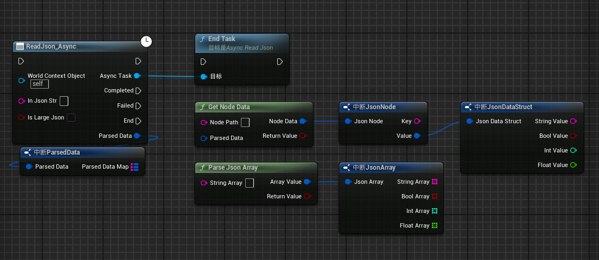
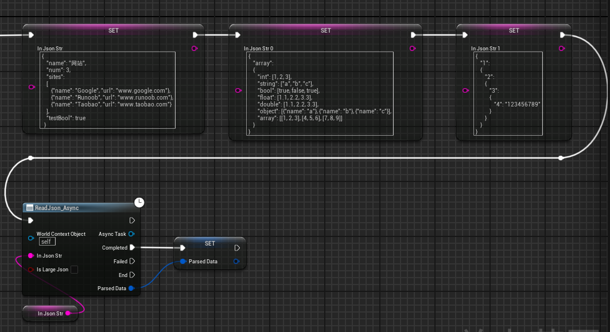
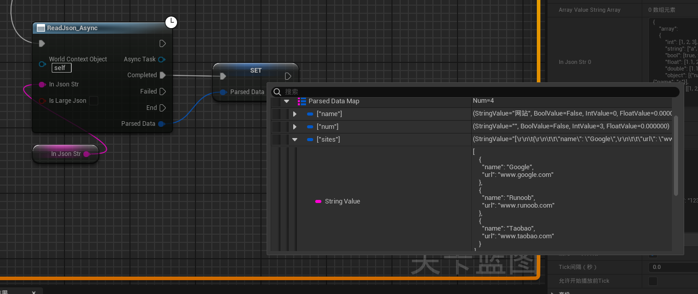
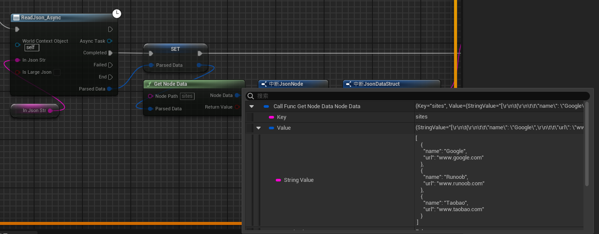
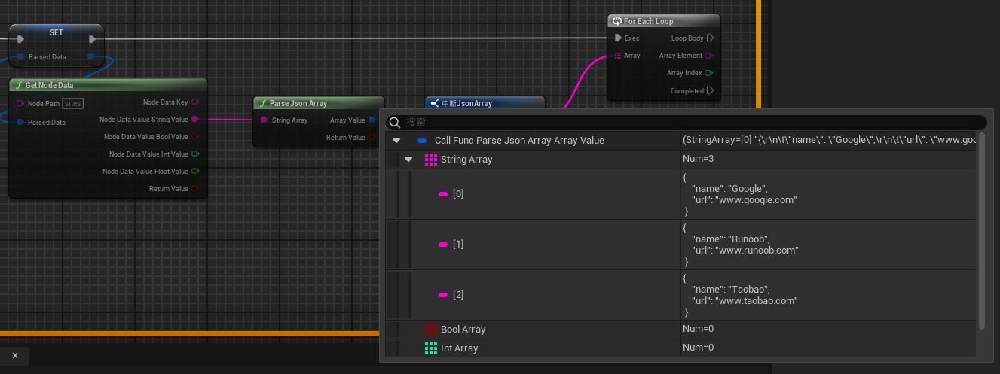
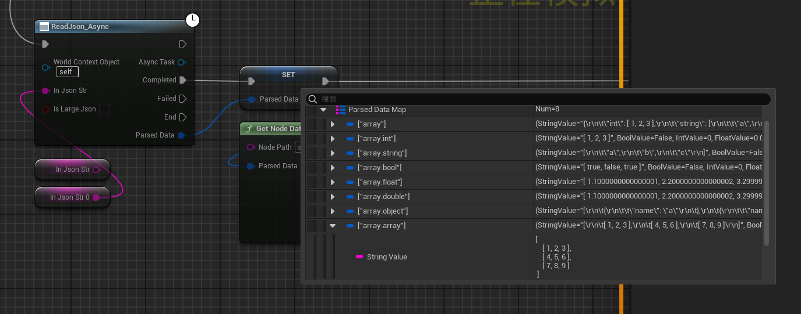
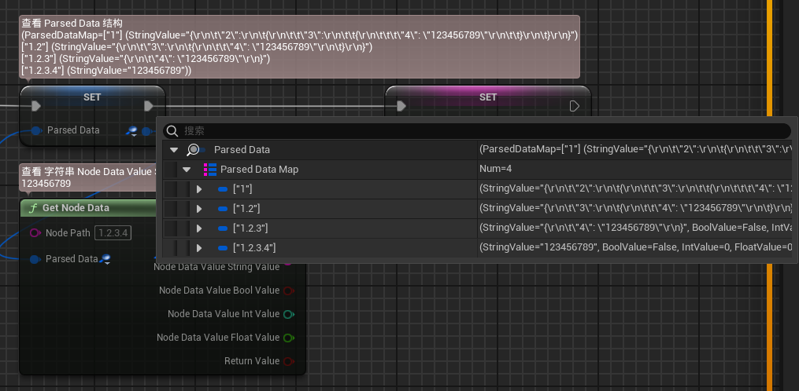
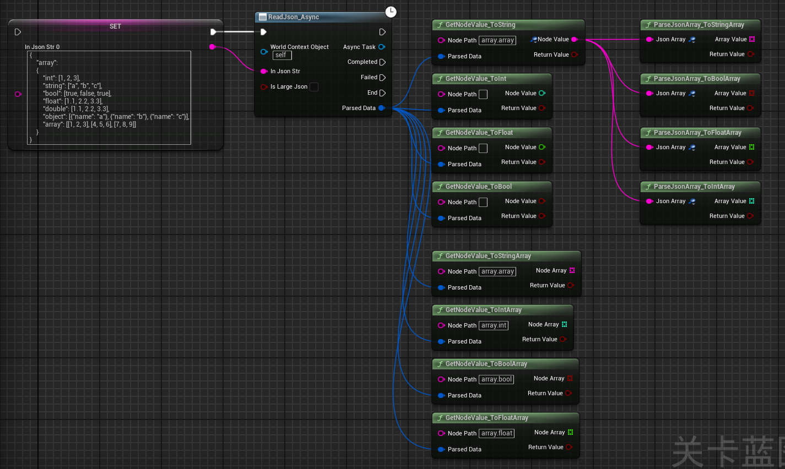
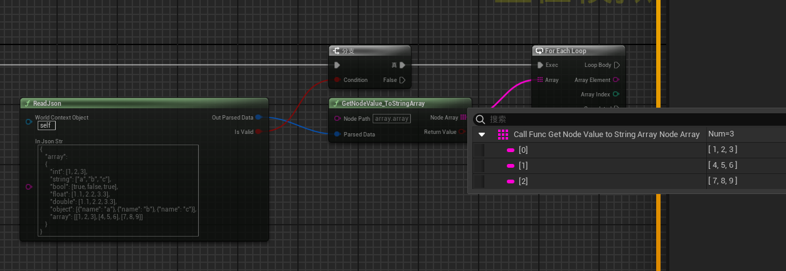

# Unreal Read Json

有别于常见的`UE`中处理`Json`的方式，灵感来源于`GameplayTag` 和 `UE JsonObject`中存储键值的方式：`TMap<FString, TSharedPtr<FJsonValue>> Values;`

UE中常见的解决方案：

1. `VaRest Plugin`：在蓝图中将`Json`字符串转成`JsonObject`，然后就是`ToValue` `ToObject` `HasFiled`等繁琐的操作
   - 优点：执行效率高
   - 缺点：遇到多层次嵌套的`JsonObject`，你将在蓝图中亲手织出一个盘丝洞
2. `JsonToStruct`：这种方案，就是用`C++`或蓝图，创建一个和`Json`完全一致的结构，甚至大小写也有影响数据解析的正确性
   - 优点：方案优雅，效率高，易维护
   - 缺点：遇到复杂的`Json`结构，需要创建N多个不同的结构体，也不是很方便


于是，我就在想，有没有一种可能，牺牲一些什么，换来一些什么？

恰好最近一直在学习`UE GAS`部分的内容，感受到`GameplayTag`作为逻辑的条件判断，非常的优雅和灵活，所以就模仿使用`GameplayTag`的方式，写了这个插件


优点：

- 通过类似`GameplayTag`的方式，定位到`Json`中值
- 不用在蓝图中织网了
- 减少专门创建一堆结构体去`JsonToStruct`

缺点：

- 也就内存占用大了一点点
- 也就消耗大了那么一点点
- `纯粹写着玩的！！！`


### 0. 大致介绍

1. 利用`UE Json`库，将`Json`字符串，依照`Json`中的键值，一对对的解析到`TMap`中
2. 遇到值为`JsonObject`，就迭代解析


遗憾：

- 考虑到复杂庞大的`Json`结构中，可能存在很多层的数组嵌套，所以我的选择是遇到值为`Array`，就将整个`Array`作为字符串作为解析值
- 如果需要解析数组的内容，需要单独使用另一个蓝图节点
- 如果数组内的元素是：
  - `int, float, int, string`就可以直接得到数组内的值
  - `object, array`则不会迭代解析，直接将整个元素作为字符串存在`StringArray`
- 总之，通过组合使用`ReadJson_Async`, `GetNodeData`和`ParseJsonArray`这两个节点，就可以解析整个`Json`中的任意内容


注意：

- `Json`数组内的元素必须一致

- 不能出现这种情况：

  ```
  [1, 2.2, "123", {key: value}, [1, 2, 3]]
  ```

- 这种的就没法使用这两个通用节点去解析了，只能自行处理了


- 以下情况的Json，暂时无法正常使用
```json
{
    "data":
    {
        "key": "value"
    },
    "data.key": "value"
}
```
- 这类`Json`，如果使用 `data.key` 取值会出现歧义问题


### 1. 蓝图节点




`ReadJson_Async`：

- 解析`Json`，将里面的键值对按照路径进行迭代，存入`ParsedData`中
- 实际使用时，建议将`ParsedData`存入变量中


`GetNodeData`：

- `NodePath`就是你需要的键值所在的路径

  ```json
  {
      "1":
      {
          "2":"123"
      }
  }
  ```

- `GetNodeData("1.2")`就可以得到`NodeData`

  ```json
  {
      "Key":"2",
      "Value":
      {
          "StringValue":, // 这里可以获得 123
          "BoolValue":,
          "IntValue":,
          "FloatValue":
      }
  }
  ```


`ParseJsonArray`：

- 用于解析由`Array`转成的字符串，如果数组元素是：`Array`, `Object` ,则会将它们转成字符串存入`StringArray`

- 例如：传入字符串到`ParseJsonArray`

  ```json
  [
          {"name": "Google", "url": "www.google.com"},
          {"name": "Runoob", "url": "www.runoob.com"},
          {"name": "Taobao", "url": "www.taobao.com"}
  ]
  ```

- 得到结构体`ArrayValue`

  ```json
  {
      "StringArray":, // 如果带解析的数组内元素是：String， Array， Object,结果都在这里
      "BoolArray",
      "IntArray",
      "FloatArray"
  }
  ```

  

考虑到数组元素是：`Array`, `Object` ,则会将它们转成字符串存入`StringArray`；

如果需要进一步解析：按照数组内元素的类型，重复使用下来的节点

- `Array`使用`ParseJsonArray`
- `Object`使用`ReadJson_Async`


### 2. 使用示例

测试 `Json`

```json
{
    "name": "网站",
    "num": 3,
    "sites": 
    [
        {"name": "Google", "url": "www.google.com"},
        {"name": "Runoob", "url": "www.runoob.com"},
        {"name": "Taobao", "url": "www.taobao.com"}
    ],
    "testBool": true
}
```

```json
{
    "array":
    {
        "int": [1, 2, 3],
        "string": ["a", "b", "c"],
        "bool": [true, false, true],
        "float": [1.1, 2.2, 3.3],
        "double": [1.1, 2.2, 3.3],
        "object": [{"name": "a"}, {"name": "b"}, {"name": "c"}],
        "array": [[1, 2, 3], [4, 5, 6], [7, 8, 9]]
    }
}
```

```json
{
    "1":
    {
        "2":
        {
            "3":
            {
                "4": "123456789"
            }
        }
    }
}
```














### 3. 更新日志




#### 3.1 GetNodeValue_To [ String, Int, Float, Bool ]

如果明确直到对应的`Node Value`的类型，可以直接使用这个系列的蓝图节点，比`GetNodeData`更简洁


#### 3.2 ParseJsonArray_To [String, Int, Float, Bool] Array

测试`Json1`：

```json
{
    "array":
    {
        "int": [1, 2, 3],
        "string": ["a", "b", "c"],
        "bool": [true, false, true],
        "float": [1.1, 2.2, 3.3],
        "double": [1.1, 2.2, 3.3],
        "object": [{"name": "a"}, {"name": "b"}, {"name": "c"}],
        "array": [[1, 2, 3], [4, 5, 6], [7, 8, 9]]
    }
}
```


如果明确知道，对应的`Node Value`的值是`Array`，可以直接用这个蓝图节点，更便捷；

注意：如果`Array`的元素是`Object`，会将`Object`解析成`String`，如果需要进一步解析，使用：`ReadJson_Async`


#### 3.3 GetNodeValue_To [String, Int, Float, Bool] Array

就是将 `GetNodeValue_ToString`和`ParseJsonArray_To[]Array`节点结合使用；

例如想要得到`Json2`中的`array.object`，直接使用`GetNodeValue_ToStringArray`，就可以直接得到 `TArray<FString>`；

其它依次类推


#### 3.4 ReadJson

用于解析较小的`Json`，使用起来比`ReadJson_Async`简单快捷




#### 3.5 更新打印日志

打印新携带调用所在的蓝图名称，方便定位所在蓝图


#### 3.6 ReadJsonByNode

集合[读取，解析]一体，面向非大型Json，一次性使用 (不推荐重复性调用，更不推荐在循环中使用)
推荐使用场景：只读取Json中一个字段使用，如果实际需求中需要读取多个Json字段，推荐使用 ReadJson + GetNodeValue 两种组合
理想情况下，一个Json只因读取一次，后续就是通过GetNodeValue获取字段值

- To [ String, Int, Float, Bool ]

- To [ String, Int, Float, Boll ]Array


#### 3.7 调整了初始化方式，兼容Linux

源码里，很多地方是这样写的：
```cpp
ParsedDataMap.Add(NewPath, { Value->AsString(), {}, {}, {}, { EValueType::String } });
```


枚举值这种 `{}`的构造初始化，打包Linux时，会有报错提示，可以通过配置项警用报错警示，但最后还是修改掉这种写法

```cpp
ParsedDataMap.Add(NewPath, { Value->AsString(), {}, {}, {}, EValueType::String });
```


#### 3.8 AI 整体规整优化

**2026-02-06** 借助AI，将整个项目重新规整优化，使用方式不变
1. 将临时结构体和宏定义全部转移到 `JsonData.h`
2. `WorldContext` 从静态成员改为实例成员，支持多实例并发
3. 修正部分日志打印消息错误
4. 整数判断优化，使用 `JsonDataHelper::IsIntegerValue()` 替代 `FMath::RoundToInt32(Num) == Num`
5. 添加 `NodeValue` 的方式从 #### 3.7 的方式改为 `FJsonDataStruct`内部构造函数的方式，更简洁